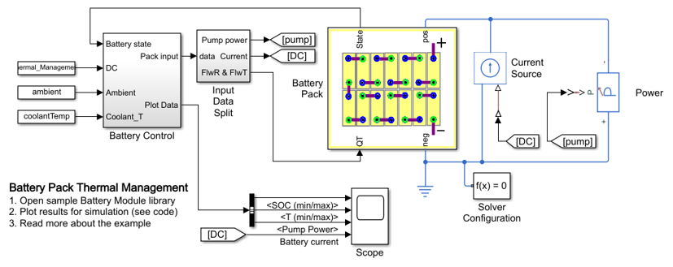
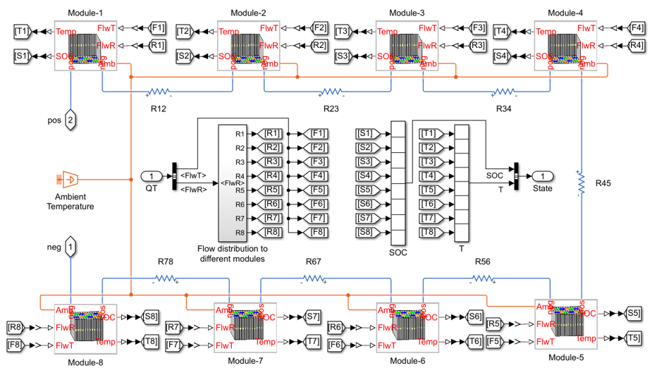

# **Battery Pack Thermal Management**
Copyright 2020 The MathWorks(TM), Inc.

This example shows how to model an automotive battery pack for
thermal management tasks. The battery pack consists of several
battery modules, which are combinations of cells in series and
parallel. Each battery cell is modeled using the
Battery (Table-Based) Simscape Electrical block. In this example,
the initial temperature and the state of charge are the same for
all cells. Eight battery modules, six of one type and two of another type,
are connected in series to simulate a battery pack. The Battery Controls
subsystem defines the logic to determine the battery pack flowrate
for the applied current load.

Open Battery_Pack_Thermal_Management.prj to get started.

Please visit the [Simscape Electrical](https://www.mathworks.com/products/simscape-electrical.html) 
page to learn more about modeling electrical systems.

## **Battery Pack Model For Testing Current Draw During Drive Cycle**

## **Battery Pack Model, 8 Modules with Electrical and Thermal Connections**

