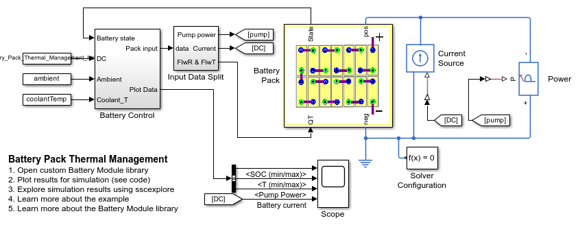
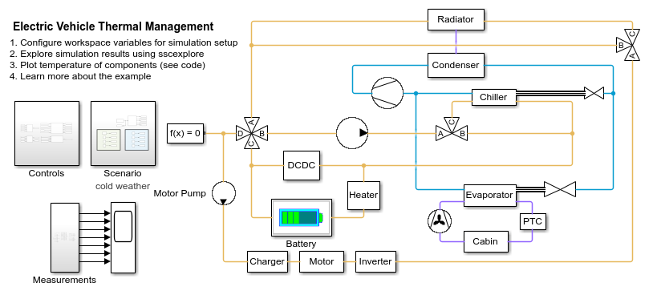

# Battery Electric Vehicle (BEV) Battery Pack Design in Simscape
Copyright 2020-2021 The MathWorks, Inc.

This repository shows use of Simscape to model an electric vehicle
battery pack. There are five examples:
1. Battery Pack Thermal Management
   * Shows how to model an automotive battery pack for thermal management tasks. 
2. Full Vehicle Thermal Management
   * Shows a BEV full vehicle thermal management with a detailed battery model.
3. Workflow from Module Design to Full Pack
   * Demonstrates a workflow to go from a detailed battery module design 
     to a real-time pack plant model
4. Battery Management System for State of Charge estimation
   * Shows how to use Kalman Filters (EKF) and predict battery state of charge.
5. Battery Temperature estimation using Neural Networks
   * Shows how to use Neural Networks to eliminate a sensor in the battery pack. 
     Demonstrates a workflow to generate training data for neural networks, 
     train the network, validate it and use for time-series prediciton, and 
     code generation for hardware deployment.

Open batteryExamplesProjectSetup.prj to get started up the project path. The 
project shortcut buttons in the toolstrip open these three examples.

All examples have a battery-module custom component that is based on 
Simscape Electrical [Battery (Table-Based)](https://www.mathworks.com/help/physmod/sps/ref/batterytablebased.html)
block for modeling battery behavior. Please visit the [Simscape Electrical](https://www.mathworks.com/products/simscape-electrical.html) 
page to learn more about modeling electrical systems.

View on File Exchange: .  
You can also open in MATLAB Online:  

## **Battery Pack Thermal Management**
You will learn how to model an automotive battery pack for
thermal management tasks. The battery pack consists of several
battery modules, which are combinations of cells in series and
parallel. The Battery Controls subsystem defines the logic to 
determine the required level of cooling for the applied current 
load. 

## **Full Vehicle Thermal Management**
You will learn how to model the complete thermal management system for 
a battery electric vehicle. The system consists of two coolant loops, a 
refrigeration loop, and a cabin HVAC loop. The thermal load are the 
batteries, the powertrain, and the cabin.

## **Workflow from Module Design to Full Pack**
You will learn how to design a battery module, build a HV pack using 
the module, and run battery plant simulations.

### **BEV Battery Module Detailed Design**

### **BEV Full-Battery Pack Plant Model**

## **Battery Management System**
You will learn how to use Kalman Filters to estimate battery state 
of charge. The battery pack consists of two battery modules, 
which are combinations of cells in series and parallel. 

## **Neural Network for Battery Temperature Prediction**
You will learn how to train, validate, deploy a neural network to predict
Battery Pack temperature.

